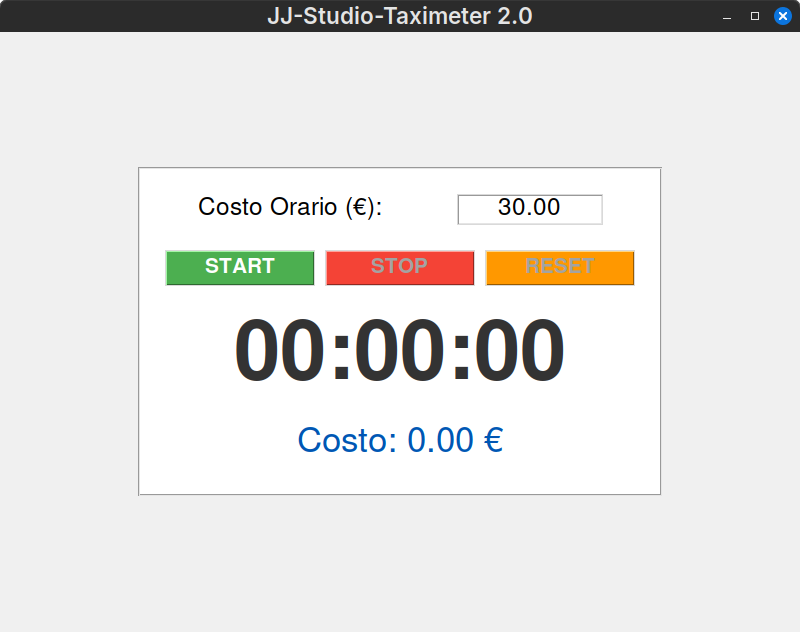
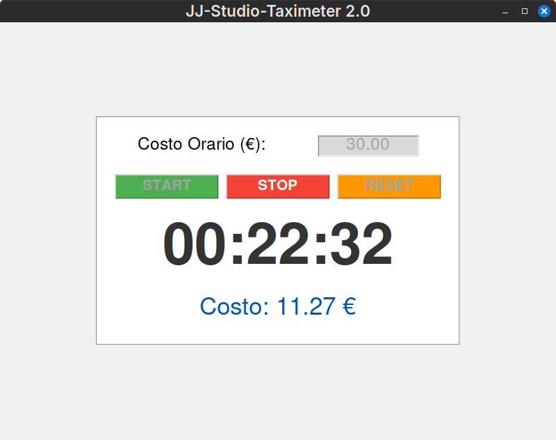
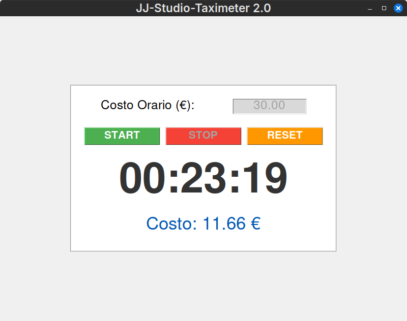

# Service Taximeter

A simple desktop application built with Python (Tkinter) designed for freelancers and service providers. It tracks time spent on tasks and automatically calculates the cost based on an hourly rate.

## Demo

Here is the application in action:

**1. Start Screen**
Ready to accept the hourly rate.


**2. Running**
The timer tracks time and cost in real-time.


**3. Stop & Result**
Final calculation after the job is done.


---

## Goal
This project was developed to address a real-world need: monitoring task duration in a service shop to provide immediate cost feedback without manual calculations.

## Features
* **Precise Stopwatch**: Uses the system clock (`time` library) to prevent time drift and ensure accuracy.
* **Real-Time Calculation**: Costs update dynamically as the timer runs.
* **Intuitive Interface**: Color-coded buttons and state management (enabled/disabled) help prevent logical errors.
* **Input Handling**: Supports both dot and comma decimal formats (e.g., 25.50 or 25,50).

##  Technologies
* Python 3.x
* Tkinter (GUI)

##  Execution
Make sure you have Python installed.

```bash
python taximeter.py
